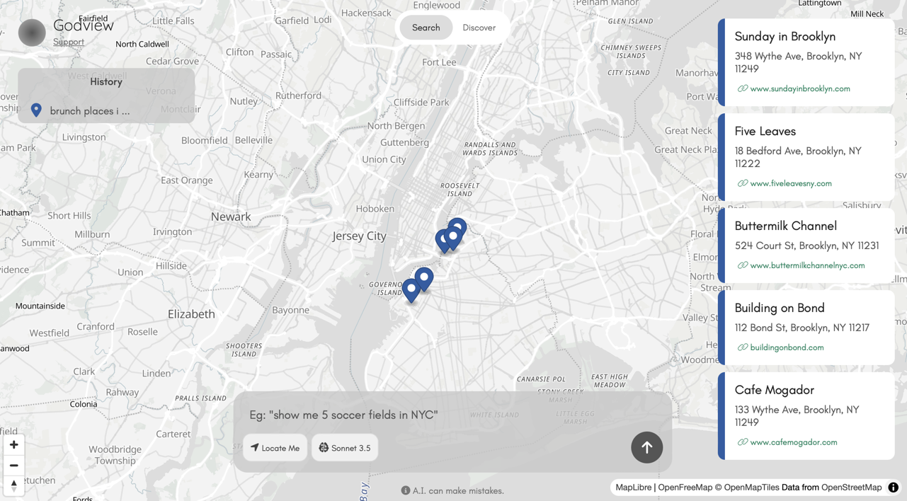

# Godview

Godview is a map based entirely on LLMs (Large Language Models) and OSM (Open Street Map).
Uses Anthropic, DeepSeek or Open AI.
Godview also runs locally with Ollama.

Website: [godview.ai](https://godview.ai)



---

# Installation

### Pull repository
`git clone https://github.com/space0blaster/godview.git`

### Install
Install dependencies.

`npm install`

If using Ollama, don't forget to install it if you don't have it already. Install at [ollama.com/](https://ollama.com/download).

### Modify Environment Files

Navigate into the `godview` directory and copy the provided example environment file.
Copy your desired tokens for each model provider or alternatively use local models (requires [Ollama](https://ollama.com) installation).
The default model for local inference is `llama3.2:3b`. You can modify this in your `.env` file to whatever model you desire (don't forget to pull it first).

```bash
cd godview
cp .env.example .env
```

### Run

Run the app.
`node index.js`

You will see this message `Godview running on port 3939`.
Open your favorite browser and head over to `http://localhost:3939`.
You can change the port number in your `.env` file.

---

# Notes

### Pages
The app has to pages, `/search` and `/discover` as seen on the top navigation bar.
Search queries the LLM based on your prompt and returns geo-locations.
Discover allows you to click on any point in the map and query the LLM for info on using the lat,long coordinates.


### Map Option
The only difference between this codebase and the codebase running on [godview.ai](https://godview.ai) is that
site uses MapBox. I chose OSM for the open-source version so you don't have to go obtain a MapBox token.

If you insist on using MapBox, simple head over to [mapbox.com](https://mapbox.com), sign up for an account and obtain a token.
In the codebase, namely the `map.interface.js` file, simply replace all the `maplibregl` classes with `mapboxgl`.
Don't forget to set your token by putting `mapboxgl.accessToken=YOUR-MAPBOX-TOKEN` and include the `.js` and `.css` file from MapBox into your `index.html` file.

### Modifying Code
The code base is located in the `/assets` folder.
`/interface` contains the JavaScript files and `/style` contains the CSS files.
The `/lib` file contains the OSM files (or any additional external files you may want to include).
If you modify any of the `/assets` files, don't forget to minify using your favorite minifier.

CSS files are minified to `style.min.css` and JavaScript files are minified to `interface.min.js`.
Those are the files called from `index.html`.

---

### Contact
You can reach me on [Twitter/X](https://x.com/amantsegai). 


### License
This codebase is under MIT license.
